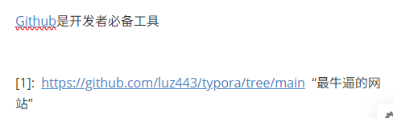

我是第一行

我是第二行

我是第三行

# 一级标题

## 二级标题

### 三级标题

#### 四级标题

*斜体*

**强调**

**qiangdiao**，因为是非常重要的

**强调**，但是我们可不在乎

**打出两个**，就是我的目标！

**强调__

***斜体强调***

~~删除掉~~

> 一级引用
>
> > 二级引用
> >
> > > 再来一次！

- [ ] 未完成
- [ ] 已完成
- [ ] 等我哦啊
- [ ] 等会我阿迪
- [ ] 玩永恒世界
- [ ] 学习编


- 无序列表
  - 子项1
  - 子项2

1. 有序列表
2. 无序列表
   1. 有序吧
      1. 有序1
   2. 有序2


我们应该用`print("hello,world!")`

```python
def hello()
	print("hello,world!")
```


[Github](https://github.com/luz443/typora/tree/main)

[Github](https://github.com/luz443/typora/tree/main "最牛逼的网站")


[Github][1]是开发者必备工具


[1]:  <https://github.com/luz443/typora/tree/main>  “最牛逼的网站”


---

---

|   a    |        b |      |      |      |
| :----: | -------: | ---- | ---- | ---- |
|        |          |      |      |      |
| 我们仨 | 来吧宝贝 |      |      |      |
|        |          |      |      |      |
|        |          |      |      |      |
|        |          |      |      |      |


1. hdowa1
2. dhuawi
3. djoaw
   1. djidjw
   2. jfoadjo
      1. djhoawid


# 今日计划

1. 学习Markdown
2. 完成作业
   - 练习表格
   - 练习链接

```python
for i in range(3):
    print(i)
```


| 产品 | 价格 | 库存 |
| ---- | ---- | ---- |
| 鼠标 | 99   | 50   |
| 键盘 | 199  | 20   |


# 第一题

我是1  

我是2  

我是3  

# 第二题

我喜欢用Markdown  

来记录笔记  

因为它即简洁又高效  

# 第三题

购物清单：  

苹果  

牛奶  

面包  

[百度](<https://www.baidu.com> “国内搜索引擎” )


[知乎](https://www.zhihu.com/ “知识分享平台”)

[Github](https://github.com/ “代码托管平台”)

[Stack Overflow](https://stackoverflow.com/questions “程序员问答社区”)、


[知乎](https://www.zhihu.com/ “知识分享平台”)

[Github][gh]

[gh]:https://github.com/ “代码托管平台”

 阿巴阿巴巴巴[^1]


[^1]:这是我的第一个脚注！
