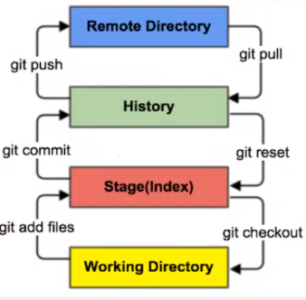
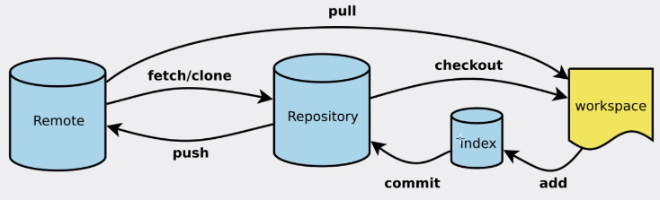
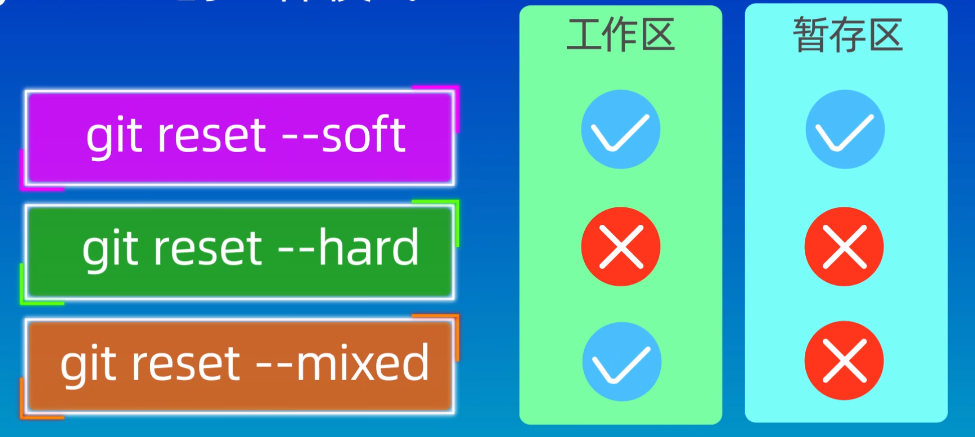
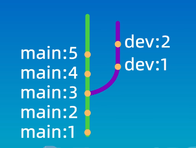
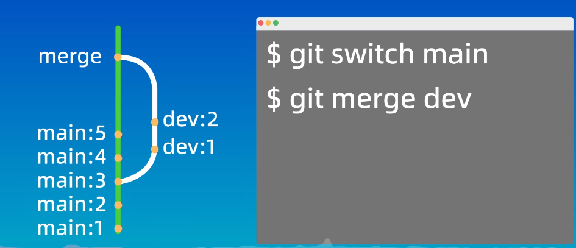

# Git

## 什么是版本控制

在开发版本迭代时，我们需要一个可以管理查看我们开发修改历史的工具，方便我们迭代开发

常见版本控制工具有Git CSS SVN

---

### 版本控制分类

- 本地版本控制：自己一个人更新记录
- 集中版本控制：所有人与大服务器交互，所有版本数据保存到一个服务器上
- 分布式版本控制：每个电脑上都有全部的版本数据，不会因为服务器损坏影响所有电脑


### 安装与卸载

下载慢时，可以挂梯子/国内找镜像下载

卸载时先删掉环境变量，再在控制面板卸载（环境变量只是为了可以全局使用）

**Git Bash**： Linux风格的命令行，使用最多

**Git CMD** ： Windows风格的命令行

**Git GUI**：图形化的git，新手不建议使用

任意文件夹右键即可打开git bash，并且按住ctrl+鼠标滚轮可以调整命令行大小

> 按alt+←返回上一页

### 基本命令

1. `cd ..` 回退到上一个目录
2. `cd +路径`  切换目录
3. `pwd` 显示当前路径
4. `clear` 清屏
5. `touch` 新建文件 例如 `touch README.md`
6. `ls` 可以列出当前目录的文件和文件夹，其中`-a`可以显示隐藏文件，`-l`可以长格式显示
7. `rm` 删除一个文件，`-i`会提醒是否确认
8.  `md`新建一个文件夹
9. `rm -r` 删除一个文件夹，其中`-r`表示递归删除，`i`提醒是否确认，共用为`-ri`
10. `mv` 移动文件

| 系统/工具      | 看末尾 `/` 或 `\`         | 真正关键点               | 快速记忆口诀               |
| -------------- | ------------------------- | ------------------------ | -------------------------- |
| Linux `mv`     | 有影响（有 `/` 强制目录） | 目标**是否存在且是目录** | 有目录放目录，没目录就改名 |
| Windows `move` | **无影响**                | 目标**是否存在**         | 存在就放进去，不存在就改名 |
| robocopy       | 不用管                    | 永远把目标当目录         | 不会改名，只复制/移动进去  |

11. `reset` 、`clear` 清屏
12. `history` 查看命令历史
13. `help` 帮助
14. `exit` 退出
15. #表示注释
16. `echo 内容 > xxx.txt` 新建一个文本文档并写入内容
17. `cat xxx.txt` 查看某个文本文件内容


### 配置

```bash
git config -l    #查看总配置
git config --system --list      #查看系统配置
git config --global ==list      #查看用户配置
```

> git配置文件的删除安装

所有的配置文件，都保存在本地文件，修改配置改变本地文件即可

- Git\etc\gitconfig 系统配置文件
- C:\Users\Administrator\ .gitconfig  用户配置文件

```bash
git config --global user.name "你的名字"
git config --global user.email "你的邮箱"
git config --global init.defaultBranch main  #仓库默认分支改为main
```

输入后才算真正配置完了git的个人信息


### Git理论




- 工作区：平时存放项目的地方
- 暂存区：临时存放你的改动（实际上只是一个文件）
- 仓库区：即本地仓库，安全存放数据的位置
- 远程仓库：托管代码的服务器


```bash
git add 文件名   #添加到暂存区
git add .   #把目录所有文件加到暂存区
git add *.txt   #把所有txt文件加到暂存区
git commit -m "信息"  #提交到本地仓库并添加修改说明
git push -u origin main #第一次push
git push  #提交到远程仓库
git pull --rebase origin main #远程更新到本地
git pull 
git status  #查看文件状态 
git status 文件名  #查看特定文件状态
git remote -v   #查看本地仓库对应的远程仓库的信息
git checkout -b 分支名称  #新建分支
git push -u origin 分支名称 #提交到分支
git branch -d 分支名称   #删除分支
git ls-files    #查看暂存区内容
git reset --soft HEAD~1  #撤销提交，保留改动到工作区，可重新add/commit
git reset --mixed HEAD~1 #改动退回到“已add未commit的”暂存区
```

注：origin为远程仓库的别名


> ### 工作流程

1. 在工作目录中修改文件
2. 把需要进行版本管理的文件放入暂存区（`git add .`）——必须至少一个文件才能add commit和push
3. 把暂存区文件提交到本地仓库( `git commit`)
4. 本地仓库的再提交到远程仓库( `git push`)

`git add`: 把工作区内容拍一张快照，放进暂存区中。无论怎么改动工作区，暂存区的快照已经定格

`git commit`： 把此刻暂存区内容拍一张快照，永久写入本地版本库（生成新的commit对象），把这个commit挂到当前分支指针上。原文件没有改动，只是多了一个指向新快照的指针

Git 从不搬运或复制文件本身，而是**保留旧快照、创建新快照、移动分支指针**。



> ### 搭建本地仓库

- 创建新仓库

1. 先在本地目录新建文件夹
2. 输入`git init` 即可初始化一个项目
3. 在远程空仓库复制URL关联，输入`git remote add origin URL`

- 克隆远程仓库

1. 在远程仓库复制地址URL
2. 在git输入`git clone URL`


---


> ### 设置本机绑定SSH公钥

设置SSH公钥，就可以实现免密码登录，方便从本地push到远程仓库

1）git上输入`ssh-keygen -t rsa` 再按enter （若要生成多把密钥，则需先按enter输入名称再按enter确认）

2）在`用户\Administrator\.ssh` 找到公钥和私钥

3）在`.ssh`文件夹内找到有pub后缀的即为公钥

4）登录github找到ssh设置，复制公钥上去

5）若在第一步生成时修改了文件名，则要在.ssh中继续新建config文件，再输入：

```bash
#github
Host github.com
HostName github.com
PreferredAuthentications publickey
IdentityFile ~/.ssh/test
```


> ### 设置忽略文件

- 用#开始的行为注释
- 可以使用通配符，*为全体字符文件
- 最前面有！的表示例外，将不被忽略
- 最前面 `/` 表示只在根目录忽略这个名字的文件夹或文件
- 最后面`/`表示忽略任意目录下同名的文件夹，不忽略文件
- 没有`/`表示忽略任意位置的文件/文件夹
- 前后各一个`/` 表示只忽略根目录下的文件夹


```bash
*.txt     #忽略所有txt
!a.txt    #除a.txt外
/temp     #根目录忽略temp的文件或文件夹
build/    #忽略任意目录下build文件夹
doc/*.txt #忽略doc下的txt
/build/   #根目录忽略build的文件夹
doc/**/*.pdf #忽略doc/目录及其子目录下的pdf文件
```


1. 项目根目录新建文件

```bash
touch .gitignore  #或者新建文本文档
```

2. 写入规则

```bash
*.log
/secret
.idea
```

3. 提交生效

```bash
git add .gitignore
git commit -m "添加忽略文件"
git push
```

注1：gitignore文件编码必须为UTF8！

注2：在新建.gitignore文件之前已经commit的文件不受它的影响，需要从暂存区删掉后重新commit转动指针

（空的文件夹默认不会被加入版本控制中）


---


> ### 新建分支

- 远程已有分支

1. 切到/新建对应本地分支

```bash
git checkout dev   #本地已有对应分支
git checkout -b dev origin/dev   #本地没有，基于远程新建本地分支并跟踪
```

2. 把文件放进仓库并推送

```bash
git add .
git commit -m "注释"
git push -u origin dev
```

- 远程没有这个分支

```bash
git checkout -b 名字  #新建本地分支
git add .
git commit -m "注释"
git push -u 分支名字  #自动创建远程分支+跟踪到远程
```


> ### 切换分支

- 工作区干净

```bash
git checkout dev   #切换本地分支
git add.
git commit -m "…"
git push -u origin dev
```

- 工作区有未提交改动（想把改动挪到另一分支）

方法一：stash暂存

```bash
git stash push -m "暂存"
git checkout dev
git stash pop
git add .
git commit -m "xxx"
git push -u origin dev
```

方法二：新建分支

```bash
git checkout -b dev  #新建并切换本地分支
git checkout -b dev 版本名   #恢复到某一提交记录的分支
git add .
git commit -m "xxx"
git push -u origin dev
```

注：`git checkout `有歧义，更多把`checkout`改为`switch`

新建分支后，新分支会复制一份原分支的所有内容作为初始内容，并不是空的


> ### 分支相关操作：

```bash
git branch      #确认当前分支
git branch -vv  #查看所有本地分支以及对应的远程以及自己在哪个分支
git branch --set-upstream-to=origin/dev   #切换跟踪的远程分支
git branch 分支名    #新建分支，但依旧停留在当前分支
git merge 分支名     #合并指定分支到当前
git log    #查看修改历史
git log --oneline 文件名   #只看某文件的历史
git branch -d 分支名 #删除已经合并的分支
git branch -D 分支名 #删除尚未合并的分支
git push origin --delete 分支名   #删除远程分支
git fetch --prune origin       #把远程已删除分支对应的本地远程跟踪分支删除
git merge --abort   #合并出现冲突时中止合并(可以重新编辑再add和commit来解决冲突)
```


分支图形化：

```bash
git log --oneline --graph --decorate --all

#也可以把上面那一串定义为新命令
alias graph="git log --oneline --graph --decorate --all"
#以后直接输入 graph 即可
```


---


> ### reset的用法

```bash
git reset --soft 版本ID
git reset --hard HEAD~1  #回退到上一次
git reset --mixed HEAD^
```



| 选项              | 版本库指针 | 暂存区   | 工作区   | 通俗效果                                               |
| ----------------- | ---------- | -------- | -------- | ------------------------------------------------------ |
| `--soft`          | 回退       | **不动** | **不动** | 只撤销提交，改动仍留在“已 add”状态，可重新 commit      |
| `--mixed`（默认） | 回退       | **清空** | **不动** | 撤销提交并取消 add，改动退回“未 add”状态，需要重新 add |
| `--hard`          | 回退       | **清空** | **清空** | 彻底回到上一版本，所有未提交改动全部丢失（危险！）     |

- `soft`: 只改指针，保留改动
- `mixed`: 改动指针+取消add，保留改动
- `hard`： 改动指针+取消add+丢掉所有未提交的改动即还原文件


**注**：可以使用`reflog` 回溯reset防止误操作


> ### 查看差异

`git diff` 可以：

1. 查看工作区、暂存区、版本库之间的差异

```bash
git diff  #我改完还没add的是什么
git diff --staged  #我add完准备commit的是啥
git diff HEAD   #此刻文件长什么样vs上一次commit（不管有没有add过）
git diff --stat  #快速显示增删改动了多少行
git diff README.md   
git diff HEAD README.md
git diff src/    #只查看目录(最好加上/表示目录)
git diff --name-only HEAD~2 HEAD  #不显示具体内容，只列改动文件
```

注意——关键在于上一次操作和现在的两个“**快照**”之间的差异

- `git diff`——工作区vs暂存区

​	跟最近一次`git add`相比，现在工作区比暂存区又多了什么

- `git diff --staged` ——暂存区vs版本库

​	跟上一次`git commit`相比，现在已经add的内容有什么差别

- `git diff HEAD` ——工作区vs版本库

​	跟上一次`git commit`相比，此刻所有未提交的改动（无论有无add）有什么差别

​	`@@ -a,b +c,d @@`：表示旧文件从第 a 行起的 b 行 ↔ 新文件从第 c 行起的 d 行

2. 查看不同版本间的差异

```bash
git diff 先前版本号（旧） 后面版本号（新） 
git diff A..B (两点和空格等价)
git diff 先前版本号 HEAD
git diff HEAD~ HEAD
git diff HEAD^ HEAD
git diff HEAD~2 HEAD
git diff HEAD~3 HEAD README.md   #查看特定文件
```

*注：* 前为旧版本，后为新版本（影响增删方向），以新版本为主体


3. 查看不同分支之间的差异

```bash
git diff main..dev  #比较两个分支最近commit快照的差异
git diff main...dev #A和B的共同祖先 → dev的最新 commit 这一段的差异
git log orgin/分支名..HEAD  #本地独有的提交列表
git diff origin/分支名..HEAD   #本地改动的具体行
```

HEAD——指向最新一次的commit


4. 查看本地和远程的差别

（1）先拿远程最新快照

```bash
git fetch origin    #下载远程快照
```

（2）再对比

| 你想看的内容                        | 命令                           | 结果             |
| ----------------------------------- | ------------------------------ | ---------------- |
| 本地分支 vs 远程分支（commit 层面） | `git log origin/分支名..HEAD`  | 本地独有提交列表 |
| 远程分支 vs 本地分支（commit 层面） | `git log HEAD..origin/分支名`  | 远程独有提交列表 |
| 代码差异（diff）                    | `git diff origin/分支名..HEAD` | 本地改动的具体行 |
| 代码差异（反向）                    | `git diff HEAD..origin/分支名` | 远程新增的具体行 |


> ### 删除文件

- 无`git`命令

```bash
rm file1.txt
git add .     #更新删除的状态
git commit -m "删除"
git push
```

- 有`git`命令

```bash
git rm 文件名     #把文件从工作区和暂存区同时删除
git rm --cached 文件名  #把文件从暂存区删掉，仅不再跟踪
git rm -r 文件夹名
git rm -r --cached 文件夹名   #把文件夹从暂存区删掉即不再跟踪
```

注意：git完后**仍需**`git commit -m "删除"`和`git push`!


---


> ### VScode集成Git

在命令行中直接输入`code ,`即可直接在当前目录启动vscode

使用`ctrl+shift+P`快捷vscode中打开命令窗口

**常见状态描述**

```bash
??  #未跟踪
M   #已修改
A   #已添加暂存
D   #已删除
R   #重命名
U   #已更新未合并
```


---


> ### Rebase操作

1. 变基

```bash
git switch dev
git rebase main  #以main为基
```

​	把从main和dev的共同祖先出发到嫁接部分的最新提交记录，来嫁接到基底上的最新提交记录后




**辨析**：注意！`rebase`与`merge`不同！

```bash
git switch main
git merge dev   #把dev合并到当前分支（main）
```




2. 辨析

- `merge`

优点：不会破坏原分支提交历史，方便回溯

缺点：产生额外节点，分支图复杂

- `rebase`

优点：不产生额外提交记录，形成线性历史，更加直观

缺点：改变历史和节点，会给他人带来困惑（避免在多人协作时使用）

```bash
git pull            #走merge流程（合并节点）
git pull --rebase   #走rebase流程（形成线性历史）
```

