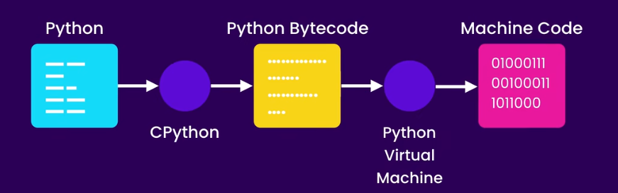
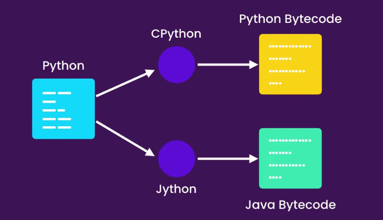

# Python——入门

---

## 基本功能
```python
print("hello world")
print('hello world')       #双引号和单引号都可以
print("*"*10)              #把*重复10次
```

ctrl+s——保存

ctrl+`——调出终端/退出终端

表达式：可以产生值的一段代码

> 在终端运行python文件

1. 使用ctrl+`打开终端
2. 输入 `python file.py` 即可运行
3. 若安装了python扩展，也可以在代码区域右键选择在终端运行
4. 若安装了code runner插件，可以**保存**后按`ctrl+alt+N` 即可运行（输出窗口）

**Linting Code**：当输入有问题时，代码下会出现红色波浪线提醒错误（按`ctrl+shift+M`切换至问题栏）

- Missing module docstring：docstring为一个文件最开头的部分，是用来告诉大家这个文件的用处
- Final newline missing：文件的最后要再添加一个空行
- UPPER_CASE naming style：常量用大写字母且用下划线连接，变量用小写字母且用下划线连接

```python
"""
This is a README.md
"""
print("hello world")

```

命令面板：按`ctrl+shift+P` 切换至命令面板

> 格式化

在命令面板输入`Format Document`，安装autopep8插件，之后再输入Format即可自动格式化

也可以在设置中打开Format On Save，保存后自动格式化

> implementations

python拥有language和implementations

- language：定义了一些语法的语言，即Cpython（用c写的）
- implementation：理解这些rules的program，如 Jython，PyPy





Python被翻译成python bytecode后被python virtual machine 翻译成机器语言

Jython被翻译成Java bytecode后被java virtual machine 翻译成机器语言


---

## 基本类型

### 变量

```python
student_count = 100
raing = 4.99
is_published = False                    #布尔值即为True或False
course_name = "Python Programming"      #字符串也可以作为数据，但要用引号包裹
print(student_count)
```

变量可以储存一段数据到内存空间里，而变量就是指针指向它储存的数据，调用变量就是调用储存的数据

### 命名标准

1. 变量要有实际含义有可读性
2. 全部小写
3. 用下划线分隔单词
4. 等号左右各一个空格


### 字符串

字符串就是文本内容，要用引号（单双三）包裹

```python
message = """
Hi,John
This is Klay Thompson!
"""
#用三引号包裹多行字符串
```

- len函数

```python
course = "Python Programming"
print(len(course))
```

len( )表示调用这个函数，但仍需引入参数或输入

*注*：这个长度包括了空格！

```python
course = "Python Programming"
print(course[0])       #首个字符为0
print(course[-1])      #-1为倒数第一个
print(course[0:3])     #从0到3，左闭右开
print(course[0:])      #从0到最后
print(course[:3])      #从0到3，左闭右开
print(course[:])       #从头到尾
```

[ ]：可以选从字符串里选特定字符，也可以slide字符串

- 引号

如果我们希望在引号里的字符串再添加引号，有几种做法

法一：单双一起用

```python
course = 'program for "beginners" '
```

法二：利用\转义

```python
course = "Python \"Programming"
#\"    #\'   #\\    #\n 均为常见的转义序列
```


### 格式化字符串

```python
first = "Mosh"
last = "Hamedani"
full = first + " " + last
print(full)
```

如果不用格式化，就要这样子拼接起来，如同上下两个例子

```python
name = "Kimi"
age = 25
message = "My name is " + name + " and I am " + str(age) + " years old."
print(message) 

#age变量输出为数字不是字符串，所以需要先用str
```

- 数字 + 数字——加法
- 字符串 + 字符串——拼接
- 字符串 + 数字——必须先把数字变为字符串，否则报错

```python
first = "Mosh"
last = "Hamedani"
full = f"{first} {last}"
print(full)
```

即可把数据（如变量、表达式、常量、函数等）格式化嵌入到字符串中，形成新的字符串

简单说就是把表达式里面的值先算出来，再把它变成字符串，再嵌入到f-string这个字符串中

表达式（产生值的一段代码）也可以被格式化，如：

```python
first = "Mosh"
last = "Hamedani"
age = 25
full = f"{len(first)} {2 + 2} {age}"
```

——除了加法拼接外，还有逗号拼接的方式

- `print(a, b, c)`把abc三个对象传给`print()`
- `print()`依次调用它们的`str()`，得到三段文本
- 在这三段文本间自动插入一个空格连接起来，末尾再打印一个换行

```python
name = "Tom"
age = 18
print("Name:", name, "Age:", age)
# 输出：Name: Tom Age: 18
```

也可以自定义分隔符和结束符（仅对当前print生效）

```python
print("A", "B", "C", sep=",", end="!!!\n")
# 输出：A,B,C!!!   (先打印！再换行)
```

> 换行相当于在下一行写，不换行相当于继续在同一行接着写

### 方法

```python
course = "Python Programming"
print(course.upper())

course = "Python Programming"
upper = course.capitalize()
print(upper)
```

变量后面加一个点，即可访问这个对象可以使用的方法。

- python视一切为对象，对象都有自己的功能，可以实行方法。

- 方法就是“绑在某一东西身上的专属工具”，比如手机是一个类型，有拍照键，可以使用这个方法，但电视机不能使用拍照键。就如`capitalize`只能字符串使用。

- 每个对象知道自己的类型，附带一本说明书知道自己的按钮，当写`“hello”.capitalize()`时，python找到`“hello”`的说明书，找到了`capitalize`这个按钮，按下返回新字符串。（原来字符串不变）
- 如果用的不是字符串，在对应说明书里没有这个按钮，就会提示你找不到。

注意在方法后加上（ ），否则它只会指向方法的引用

**常用方法：**

1. `capitalize` (只可用于字符串)

- 第一个字符是字母就大写，不是字母就不变
- 其余字符如果是字母全部变小写，不是字母就不变

```python
course = "Python Programming"
upper = course.capitalize()
print(upper)      #输出： Python programming
```

> 注：方法各自有各自的所属的类型（字符串、整数、列表、字典等），想用必须保证对象属于那个类型

2. `title`（只用于字符串）

- 只有字母和数字不是单词的边界，其余（空格、标点、符号）都是单词边界
- 按照边界分割成几个单词，每个单词首字母大写，其余变小写

```python
s = "hello world"
print(s.title())        # Hello World

s2 = "it's a good day"
print(s2.title())       # It'S A Good Day  (注意s也要大写) 

s = "rock-n-roll 2024aBc"
print(s.title())        # 结果: Rock-N-Roll 2024Abc
```

3. `upper`（只适用于字符串）

- 非字母字符保持不变

- 所有字母变成大写

 ```python
 s = "Hello, 世界! 123"
 print(s.upper())        # HELLO, 世界! 123
 ```

4. `strip` （只适用于字符串）

| 方法       | 用法                           |
| ---------- | ------------------------------ |
| `strip()`  | 同时剪左右两端的空白或指定字符 |
| `lstrip()` | 只剪左边                       |
| `rstrip()` | 只剪右边                       |

- 空白字符：

```python
空格 " "
tab "\t"
换行 "\n"
回车 "\r"
```

-  剪除规则：

从外向内扫描，遇到第一个不在剪除列表的就立即停止。之后无论再出现什么都不再继续剪

```python
s = "  \t\n hello world \n  "
print(s.strip())          # "hello world"   去掉两端空白
print(s.lstrip())         # "hello world \n  "   只去左边
print(s.rstrip())         # "  \t\n hello world" 只去右边

path = "///home/user///"
print(path.strip("/"))    # "home/user"
```

> 换行和回车的区别：window中换到下一行为\r\n，linux和mac中换下一行为\n一个字符

*注意*：指定字符剪除时注意在`strip()`的括号内用引号括起来

5. `find`（只适用于字符串）

找到目标字符串在原字符串的索引位置（第一次出现的位置）

```python
course = "  python programming"
print(course.find("pro"))           #输出 9
print(course.find("Pro"))           #输出 -1 （原字符串找不到这个字符串）
print(course.find("pro",2,12))      #输出 9
```

`str.find(sub, start=?, end=?)`

注意：sub应用引号括起来，start和end中**左闭右开**，此方法不会报错

6. `index`

```python
s = "hello world"
print(s.index("o"))       # 4
print(s.index("o", 5))    # 7
print(s.index("abc"))     # ValueError: substring not found
```

> find和index用法一样，唯一区别在于index找不到就报错崩溃

- 当确定子串一定存在，出错就是程序bug——用`index`，暴露出异常
- 子串可能不存在——用`find`避免崩溃

7. `replace`

把字符串的某些字符换成别的字符，返回新字符串，原串不变

`str.replace("old","new",count)`

——count为最多替换几次（不写或写负数为全部替换）

```python
s = "one one one"
print(s.replace("one", "two"))
# two two two   （全部替换）

print(s.replace("one", "two", 1))
# two one one   （只替换第 1 个）

text = "a1b2c3"
result = text.replace("1", "一").replace("2", "二").replace("3", "三")
# a一b二c三
```

8. `in` 与 `not in`

判断语句，判断子串是还是不是在字符串中，返回布尔值（True/False）

``` python
course = "  python programming"
print("pro" in course)           #True
print("swift" not in course)     #True
```

9. exit（）

```python
import sys
sys.exit(0)   # 或者非 0 值
```

exit()中的括号内可以为0或1,0为正常退出，1为异常退出

- 0 → 一切正常
- 1 → 出错了，停止后续或触发错误处理，日志监控这个位置出现错误

### 数字

```python
x = 1         #整数
x = 2,5       #小数
x = 1 + 2j    #复数即1+2i
```

- 数字运算法则

```python
print(10 + 3)
print(10 - 3)
print(10 * 3)
print(10 / 3)      #普通除法，结果为浮点数（一定带小数点）
print(10 // 3)     #地板除法，向下取整取到不比自己大的数字
print(10 % 3)      #结果为余数
print(10 ** 3)     #10的三次幂
```

注意：python做普通除法时自动显示最少必要的小数点位数，`6 / 2`结果为3.0

- 增广赋值运算符

在普通运算符后直接加 `=` 让先算再存一步到位

| 运算符 | 完整写法     | 增广写法  | 作用         |
| ------ | ------------ | --------- | ------------ |
| `+=`   | `a = a + b`  | `a += b`  | 加后赋值     |
| `-=`   | `a = a - b`  | `a -= b`  | 减后赋值     |
| `*=`   | `a = a * b`  | `a *= b`  | 乘后赋值     |
| `/=`   | `a = a / b`  | `a /= b`  | 除后赋值     |
| `//=`  | `a = a // b` | `a //= b` | 地板除后赋值 |
| `%=`   | `a = a % b`  | `a %= b`  | 取余后赋值   |
| `**=`  | `a = a ** b` | `a **= b` | 幂运算后赋值 |

### 处理数字的函数

1. `round`

只对数字生效，遵循**“四舍六入五留双”**——五时保留前一位为偶数

```python
round(number, ndigits=None)
```

- ndigits：保留几位小数
  - 省略或为None → 返回整数
  - 正数 → 保留小数位
  - 负数 → 保留到十位、百位、千位
  - 0 →先保留到整数，再加 .0
- 四舍六入五留双——要保留位数的下一位
  - 只要5后面还有非0数字，一定进位
  - 5后为0时，看保留位数的数字是奇数还是偶数，偶数不变，奇数加1
  - <5就舍，>5就入

> 注：二进制有时会有精度误差如3.55在二进制存的是3.54999… 故有时保留后结果会不同！

2. `abs`

取绝对值或取模长

```python
print(abs(-10))      # 10
print(abs(-2.5))     # 2.5
print(abs(3+4j))     # 5.0
```

3. `ceil`——向上取到最近的不比自己小的整数

```python
import math

print(math.ceil(3.2))   # 4
print(math.ceil(3.0))   # 3
print(math.ceil(-3.2))  # -3   （-3 > -3.2，向上！）
```

4. 模块中的函数

```python
import math
math.
```

先引入再在对象math后加.取方法，在括号里引入参数

> 在网上搜索 python 3 math module 查看module内详细函数介绍

5. `bool`

bool把任何值（数字、字符串、列表、None）都变成True/False两个值

| 类别   | 为 **False** 的典型值           | 其余为 **True**    |
| ------ | ------------------------------- | ------------------ |
| 数字   | `0`, `0.0`                      | 所有非 0           |
| 字符串 | `""`（空串）                    | 任何非空串 `"abc"` |
| 容器   | `[]`, `()`, `{}`, `set()`, `""` | 只要里面有元素     |
| 特殊   | `None`, `False`                 | 其余对象           |

即为**有没有**探测器，空/0/None均为False，其余均为True

### 转换类型

```python
x = input("x = ")
y = x + 1
print(y)
```

这里会报错！因为input永远返回字符串，而字符串不能和数字直接相加，需要转换类型！

input中“x = ”不在返回的字符串内，用户输入的才是返回的字符串，因此可以直接取int

| 原始值   | int 结果 | float 结果 | 备注                                       |
| -------- | -------- | ---------- | ------------------------------------------ |
| `"123"`  | `123`    | `123.0`    | 字符串转数字                               |
| `3.14`   | `3`      | `3.14`     | 浮点→整数直接**截断**（不四舍五入）        |
| `"3.14"` | ❌ 报错   | `3.14`     | 带小数点的字符串转 `int` 会抛 `ValueError` |
| `True`   | `1`      | `1.0`      | 布尔值当作 1/0                             |
| `False`  | `0`      | `0.0`      |                                            |

- int遇到数字时整数不变，小数直接截断；遇到字符串时整数不变，小数直接报错
- float遇到整数加.0 ，遇到小数不变

注：可以用type函数得到目标到底是什么类型（字符串、数字、字典…）
