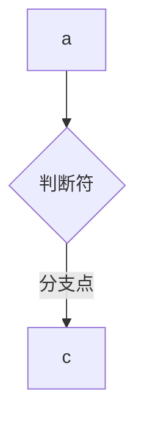

# markdown文件书写

---

## markdown文件是什么？

markdown文件是一种快速美观的编辑方式


## md文件语法规则

### 表格

```markdown
| 姓名 | 年龄 | 城市 |
| --- | --- | --- |
| 张三 | 25  | 北京 |
| 李四 | 30  | 上海 |
```

具体效果：

| 姓名 | 年龄 | 城市 |
| :--- | ---- | ---- |
|      |      |      |
|      |      |      |

注意事项：

- 上下列数一致！即竖线数量相同
- 在第二行控制对齐方式，控制整一列的对齐方式（注意均为**英文半角状态**）
  - --- 默认左对齐
  - :--- 左对齐
  - ---: 右对齐
  - :---: 居中对齐
- 在竖线间留空即可实现空单格位

```markd
| 标题1 | 标题2 |
| --- | --- |
| 数据 |  |
```


### 标题

```markd
# 一级标题
## 二级标题
### 三级标题
```

***注意***：#和文字之间必须有空格！


### 段落和换行

- 段落：直接按两次enter即可
- 换行：行尾加两个空格（*英文空格*），再按enter。否则md文件自动把上下两行合并为一起

```markd
这是第一行  
这是第二行（上一行必须要有两个空格）

这是新段落
```

**注意**：标准md文件必须遵循两个空格的规则（即硬换行），但typora支持软换行，可以在设置调整，总之要养成好习惯！


### 加粗&斜体

```markd
*斜体*
**加粗**
***又加粗又斜体***
```

注：*也可以用_替代


### 无序列表

```markd
- 苹果
- 香蕉
	- 大香蕉
```

注意：

- 具体在typora书写时非常方便，按enter即可只用写第一个句点
- 注意- 和文字之间有一个空格！
- 按tab键即可缩进到更小单元


### 有序列表

```markd
1. 起床
2. 收拾
	1. 刷牙
```

注意事项与上一个无序列表相同


### 待办方格

```markd
- [ ] 
- [x]
	- [x]
```

- 必须为英文的-和[ ]
- -与[ ]、[ ]内部、[ ]与文字之间必须均有空格
- 也可以嵌套方格


### 行内代码&代码块

````markd
单行内代码用`print()`

多行代码用三个```包裹，并指定语言
```python
def hello():
	print("hello,Markdown!")
```
````

注意分为单行和多行代码两种情况 


### 分隔号

```markd
---
```

实际效果：

---


### 引用

```markd
> 鲁迅说过（一级引用）
>> 达芬奇说过（二级引用）
```

> 鲁迅说过
>
> > 爱迪生说过
> >
> > > 达莉亚说过


### 链接

```markd
1.行内链接
[百度](https://www.baidu.com "国内搜索引擎")

2.引用链接
我经常去 [GitHub][gh] 查资料。
[gh]: https://github.com "全球最大同性交友网站"

3.脚注
今天天气真好[^1]。  
[^1]: 适合出去散步。  
```


- 行内链接：

1. [ ] ( ) “ ”均为英文半角！
2. URL与备注之间留有空格

- 引用链接

1. 效果与行内链接相同，只是在源代码处更加美观
2. [ ]内自己命名，同时注意: 与文字之间留有空格！URL与备注之间留有空格！

- 脚注

1. 脚注必须要用 ^+脚注标志的结构
2. 同样: 与文字之间留有空格


**Tip1:**在typora语法中，会要求在裸链接中加入< >，这不属于md语法，只是typora自己要求的。

**Tip2**:脚注的效果为跳转到页尾，引用链接与行内链接效果相同

**Tip3**:typora较为宽松，即使用了中文引号（英文为直的，中文为斜的）、没有加*英文*空格（中文2节，英文1字节）也会渲染成功，但github不会渲染


### 图片插入

```markd

```

在typora中插入较简单，简单粘贴插入即可


### mermaid图表




### 删除和下划线

```markd
~~删除内容~~

<u>重点内容</u>
```


<u> 和 </u> 为HTML标签（我没学过）
